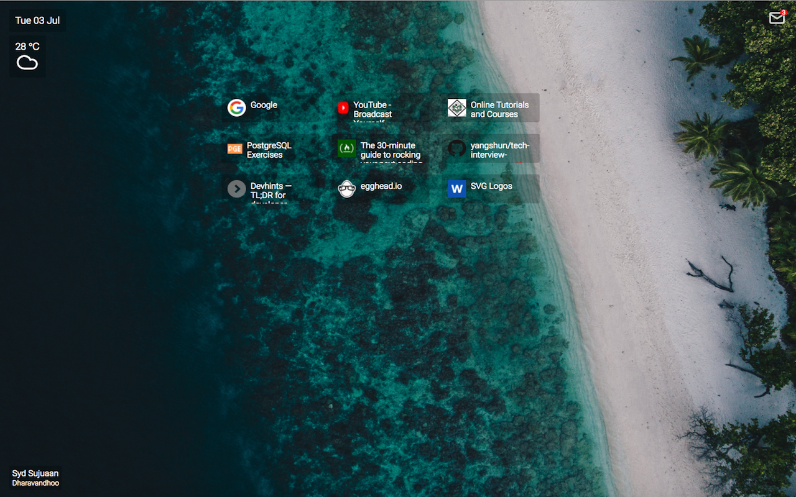

## Novus
A Chrome extension that enhances bookmarks management.
 
Features:
- Bookmarks displayed with associated icons.
- Fully responsive and draggable bookmarks grid [IN PROGRESS]
- Add, update and remove bookmarks [IN PROGRESS]
- Beautiful and calming background images are provided by unsplash.com. A new image every day.
- Gmail notifications for unread e-mails.
- Current date and weather.
 
 

 
https://chrome.google.com/webstore/detail/novus/ikfdchbhkfpepkagkmgadeejgnmabbll?utm_source=chrome-ntp-icon
